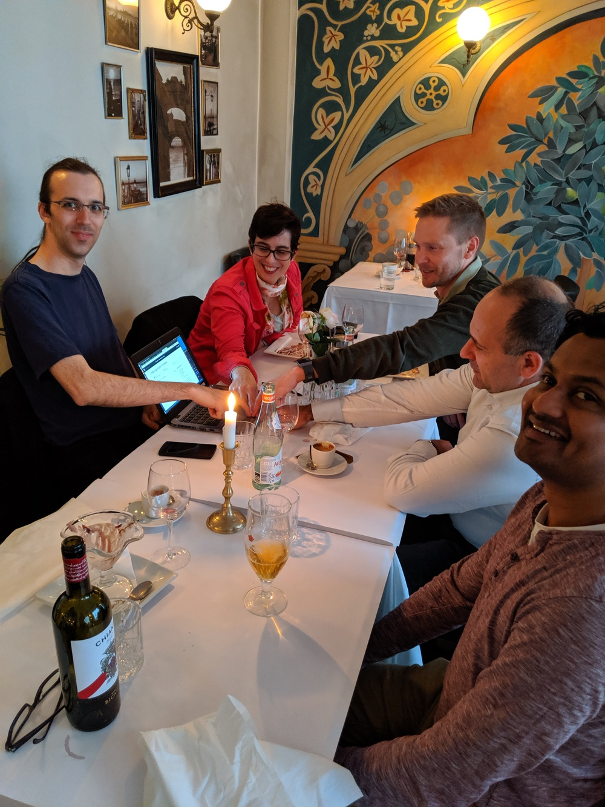

class: center, middle

# NordicHPC: Welcome and introduction

Text is free to share and remix under [CC-BY-4.0](https://creativecommons.org/licenses/by/4.0/)

Richard Darst and Radovan Bast

---

# How we got here

.left-column[
- Early 2019: Richard visits Tromsø
- May 2019: Workshop at NeIC conference [Reimagining Research Computing](https://nordichpc.github.io/2019-05-15-neic/)
- In the evening: restaurant visit and discussion
- Decision to organize this event
]

.right-column[

]

---

class: center, middle

## What do we want to get out of this?

---

# Networking

Our program is designed with lots of breaks to talk and enjoy our time.

## Let's introduce ourselves!

.left-column[
- Denmark
  - SDU 1
  - KU 1
  - DeiC 1
- Estonia
  - Tartu 1
- Finland
  - Aalto 5
  - CSC 3
  - Helsinki 3
  - Tampere 1
  - Oulu 3
]

.right-column[
- Iceland
  - UI 1
- Norway
  - UiO 1
  - UiT 1
- Sweden
  - KTH 1
  - Linköping 1
  - Lund 3
  - Uppsala 3
]

---

# More goals

- Want to run your infrastructure better by **sharing ideas and projects**
- Want a **network of like-minded people**
- Want to ensure the future of "HPC" by **adapting to the present**
- **Solve problems**

---

# Why NordicHPC?

- We could have more interaction
- Some national interaction, more international
- We all have similar problems, but invent our own solutions
- The whole concept of HPC needs development
- People are turned off because of usability and old-fashioned mindset

---

# Accessibility and usability

- "HPC" often means "big stuff"
- Clusters should be an appropriate place also for medium sized jobs
- Too much focus on https://www.top500.org?
- Some academic domains are better served than others
- Documentation is often not adapted to user needs
- Often too much bureaucracy to get on a machine
- Interfaces often limited to terminal
- Clusters aren't adapting to the needs of users
- Usability is driving people out
- Often it's easier to spend your own money on commercial cloud services

---

class: center, middle

## What can we do?

---

# Share good ideas

- We all have the similar problems, but different unique solutions. Why not share?
- Let's also share the "bad" ideas: things that did not work out.
- We have the talk "Cool things and problems" and lightning talks.

---

# Shared maintenance of projects

> *If you want to go fast, go alone. If you want to go far, go together.* [African proverb]

- It's fun to work alone, but can be even more fun to work together
- https://github.com/NordicHPC/ is a shared repository for "stuff" - anything that could be useful.
- Donating to shared maintenance means more eyes, more use, and more visibility.
- More info in a lightning talk.

---

class: center, middle

## Open questions

---

# NordicHPC is not a good name

- "HPC" means "big stuff". It can be perceived as exclusive and excluding. Our clusters are appropriate for more than the big stuff.
- We want everyone to see the value of our services.
- Including "HPC" in our name isn't exactly the way to do that.

---

# More meetings?

- There are plenty of Nordic computing meetings and projects, but few focused on our specific type of problem.
- The Nordic e-Infrastructure Collaboration (NeIC) will probably fund more meetings like this if we make a good case.
- To be discussed at the end of the meeting, under "future".

---

# This meeting?

- We need to set the stage behind what we are doing.
- Richard will present practical info next.

## Thanks to Aalto Science-IT for sponsoring this event!
